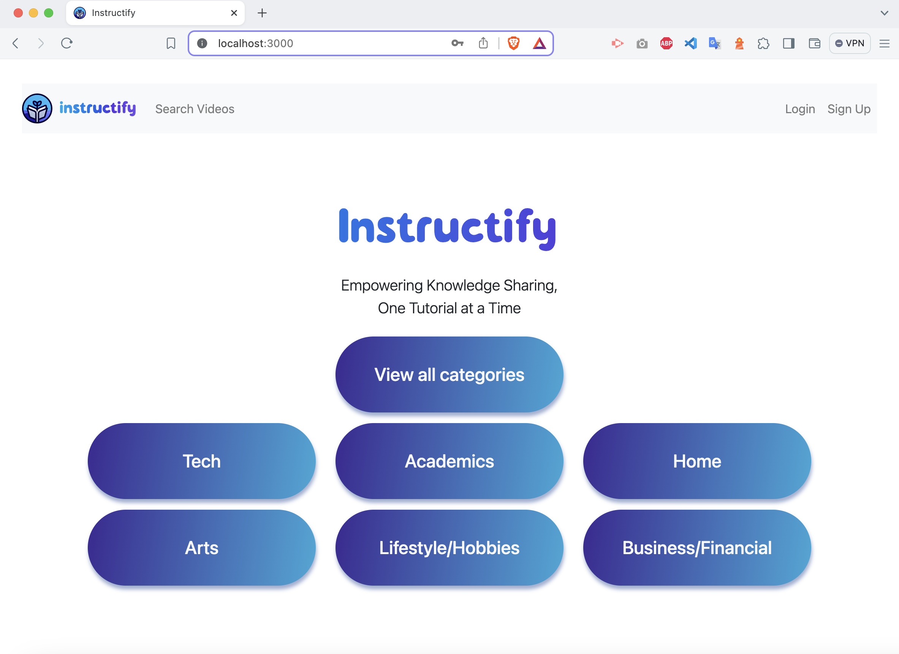

# Instructify

## Description

Instructify is a dynamic full-stack MERN (MongoDB, Express, React, Node.js) application designed to facilitate the sharing and discovery of tutorials. Users can post and comment on tutorials, including YouTube videos via the YouTube API. This platform enhances learning by providing a community-driven space for knowledge sharing.

## Table of Contents

- [Features](#features)
- [Technology Stack](#technology-stack)
- [Getting Started](#getting-started)
- [Usage](#usage)
- [Contributing](#contributing)
- [Deployment](#deployment)
- [Authors and Acknowledgments](#authors-and-acknowledgments)
- [License](#license)

## Features

- **User Authentication:** Secure signup and login functionality with JWT.
- **Interactive Tutorial Search:** Users can search for tutorials and view detailed information.
- **Comment System:** Users can post comments on tutorials to facilitate discussion.
- **Responsive Design:** A polished UI that is fully responsive, ensuring a great experience on all devices.
- **GraphQL API:** Efficient data fetching with queries and mutations for retrieving, adding, updating, and deleting data.
- **Protected API Keys:** Ensuring sensitive information remains secure.

## Technology Stack

- **MongoDB & Mongoose:** For database management and schema definition.
- **Express.js:** For server-side logic and API routes.
- **React:** For building interactive user interfaces.
- **Node.js:** For server-side runtime environment.
- **GraphQL:** For efficient data querying and manipulation.
- **YouTube API:** For integrating YouTube video search functionality.

### Front-end Setup with React + Vite

This project uses Vite for the front-end setup to leverage fast Hot Module Replacement (HMR) and modern build tools. Vite is configured to work with React, providing an efficient and modern development experience.

Currently, two official plugins are available for React:

- [@vitejs/plugin-react](https://github.com/vitejs/vite-plugin-react/blob/main/packages/plugin-react/README.md) uses [Babel](https://babeljs.io/) for Fast Refresh.
- [@vitejs/plugin-react-swc](https://github.com/vitejs/vite-plugin-react-swc) uses [SWC](https://swc.rs/) for Fast Refresh.

## Getting Started

### Prerequisites

- **Node.js:** Ensure you have Node.js installed on your machine to run server-side code.
- **MongoDB:** Required for database operations; ensure MongoDB is installed and running.
- **YouTube API Key:** You need a YouTube API key to fetch videos from YouTube.

### Installation

1. Clone the repository using `git clone https://github.com/rafarizvi/instructify.git`.
2. Navigate to the project directory in your terminal.
3. Run `npm install` to install dependencies from npm.
4. Copy the `.env.EXAMPLE` file to a new file named `.env` and update it with your specific environment variables.

## Usage

After completing the installation steps, you're ready to start using Instructify. Here's how to get started:

1. **Starting the Server**

   - With the dependencies installed and your .env file set up, navigate to your project directory in the terminal.
   - Run `npm run dev` to start the server and client concurrently. This will boot up your application.

2. **Accessing the Platform**

   - Open your web browser and visit http://localhost:3000. This will take you to Instructify's homepage.
   - If you see the main interface of the application, the server is running correctly!

   

3. **Exploring Features**
   - **_Create an Account or Log In:_** To take full advantage of the platform's features, including posting and commenting on tutorials, you'll need to create an account or log in. Click on the "Signup" or "Login" navigation links to access these features.
   - **_Searching for Tutorials:_** Use the search bar on the home page to find tutorials. You can search by tutorial categories or directly look up tutorial videos.
   - **_Posting Comments:_** When logged in, you can post comments on tutorial pages to engage with the community.

## Contributing

Your contributions are what make the community incredible. If you have an idea for improving this project, please fork the repository and create a pull request, or open an issue with your suggestions. For substantial changes, please open an issue first to discuss what you would like to change.

## Deployment

This application is deployed on Render. You can access it [here](https://instructify.onrender.com/).

## Authors and Acknowledgments

- **Daniel Araujo** - [GitHub](https://github.com/danielhe27)
- **Tamer Bekir** - [GitHub](https://github.com/Tamerbekir)
- **Rafa Rizvi** - [GitHub](https://github.com/rafarizvi)
- **Katy Totah** - [GitHub](https://github.com/ktotah)

Special thanks to everyone who has contributed to making this project a success.

## License

This project is released under the [MIT License](/LICENSE).